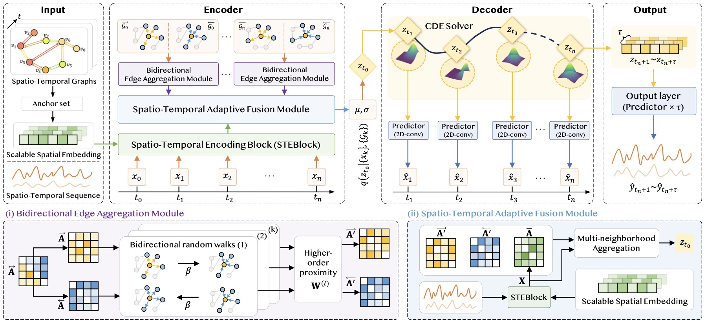

## **CSSG: Continuous Spatio-temporal Graph Learning Framework**
[](https://img.shields.io/badge/PyTorch-1.10%2B-orange)
Official implementation for "CSSG: A Continuous Spatio-temporal Graph Learning Framework with Scalable Spatial Granularity".


## **Abstract**
Spatio-temporal data is extensively collected in ubiquitous cyber-physical systems, where modeling complex spatio-temporal dependencies using Spatio-temporal Graph (STG) is crucial for downstream decision-making tasks. However, these tasks often necessitate that STG methods adapt to the coupling between varying spatial granularity and continuous temporal evolution, leading to certain limitations in the scalability and dynamic continuous-time modeling capabilities of existing methods. To this end, we propose a Continuous spatio-temporal graph learning framework with Scalable Spatial Granularity (CSSG). This framework establishes the coupling between scalable spatial granularity and continuous temporal evolution through anchor set-based spatial modeling and local conservation-based temporal modeling. Specifically, CSSG first derives the initial node spatio-temporal embeddings using a spatio-temporal encoding module that takes scalable spatial embeddings based on anchor sets as input. Then, a bidirectional differential edge aggregation module dynamically updates the continuous interaction weights of edges based on local conservation. Finally, a spatio-temporal adaptive fusion module integrates continuous change patterns of bidirectional edges into a unified node representation, generating initial node states for the decoder to infer future states. Extensive experiments on various real-world datasets verify the scalability and effectiveness of CSSG in continuous spatio-temporal prediction for varying spatial granularities, while also demonstrating greater efficiency compared to state-of-the-art solutions with comparable performance.
## Installation
Main package requirements:
```bash
conda create -n cssg python=3.9
conda activate cssg
pip install -r requirements.txt
```
## Data Preparation
For the CHITaxi dataset, you can download the raw data for the spatio-temporal graph adjacency matrix after the random walk from [Google Drive](https://drive.google.com/drive/folders/1wjTRio8USE5HM252-gy6aqNp5YqvsBvk?usp=drive_link). After downloading, please place the data files in the `data/CHITaxi` folder.

## Running Scripts
To train the CSSG, run the following command in the directory `./`:
```
bash run.sh --dataset=<DATASET> --device=<GPU_ID>
```
Explanation for the arguments:
- `DATASET`:name for using dataset.  `CHITaxi` , `WSHTaxi`, and so on are available.
- `GPU_ID`: Specifies the GPU identifier to be used for training.

## Training Log Files
The training logs will be stored in the `runs/CHITaxi/` directory. These logs include:
- Hyperparameters used for training.
- Training loss and validation loss for each epoch.
- Performance metrics recorded during the training process.

## Code Structure
```
conf/                      # Configure file
└── CHITaxi_CSSG.conf
│
controldiffeq/             # NCDE tool files
├── __init__.py            # Package initialization file
├── cdeint_module.py       # NCDE related module
├── interpolate.py          # Interpolation related functions
└── misc.py                # Miscellaneous functions
│
data/                      # Data files, e.g., CHITaxi
└── CHITaxi/
│
data_process/              # Data preprocessing and loading files
├── dataloader.py          # Data loader
└── load_dataset.py        # Dataset loading functions
│
lib/                       # Training and metrics calculation files
├── add_window.py          # Window addition functionality
├── embedding_layer.py     # Embedding layer implementation
├── logger.py              # Logging functionality
├── metrics.py             # Metrics computation functions
├── normalization.py       # Data normalization functions
├── Trainer.py             # Training-related functionalities
└── TrainInits.py          # Training initialization settings
│
model/                     # Model construction files
├── encoder.py             # Encoder implementation
└── GSSG_model.py          # GSSG model implementation
│
runs/                      # Run log files
├── CHITaxi/
│
main.py                    # Main file
README.md                  # Project documentation file
```
